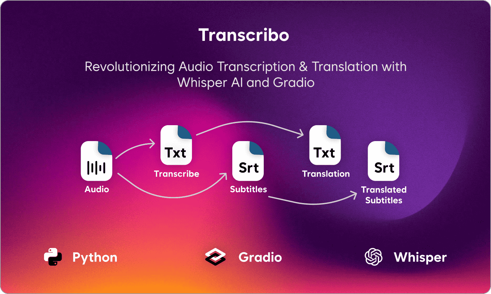
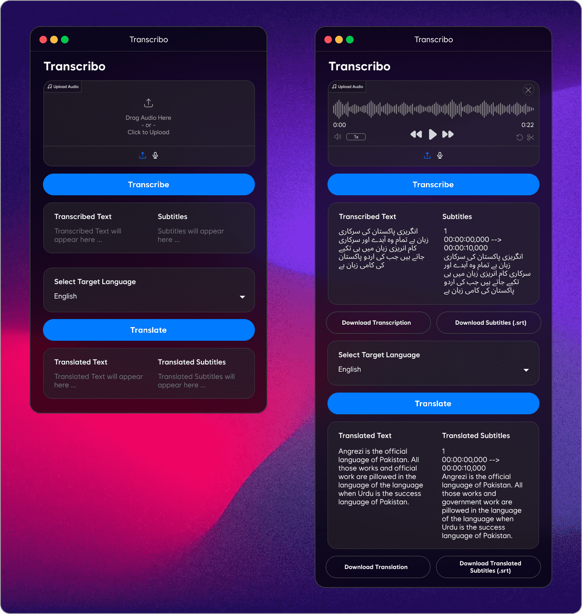

# Transcibo
This Python project uses **OpenAI Whisper** for **audio transcription** and **subtitle generation**. It also supports **translation** using **Deep-Translator** and provides file export options for **TXT** and **SRT** formats.

**[Live Demo](https://huggingface.co/spaces/mmohsin7/Transcribo)**

## Features
- **Transcribe Audio** – Convert speech to text using OpenAI Whisper.  
- **Generate Subtitles** – Create `.srt` subtitles for the transcribed text.  
- **Translate Text & Subtitles** – Translate transcriptions and subtitles with Deep-Translator.  
- **Download Options** – Export transcribed and translated text as `.txt` or `.srt` files.  

## Get Started
1. Install `Whisper` and `deep-translator` in your project.
2. Create a user interface using `Gradio` of that app.
3. Create function for get Text and Subtitles from audio using `Whisper`
4. Create function for get translation of that audio text and subtitles using `deep-translator`.
5. Save text and subtitles in `.txt` and `.srt` files and link that files with download buttons.

## Usage
- Upload an audio file to transcribe.
- Generate subtitles and translations.
- Download the output in TXT or SRT format.

## Output

